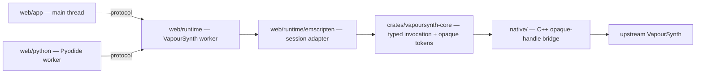

# VapourSynth WebAssembly

This project compiles the real upstream VapourSynth core to WebAssembly with Emscripten and runs it inside a dedicated browser worker, with a safe `no_std` Rust token-validation and invocation layer behind a narrow C++ opaque-handle bridge. Python scripts are authored in a separate Pyodide worker: the synchronous `vapoursynth` package records a graph plan, which the VapourSynth worker then executes with one generic typed invocation per operation, so no raw upstream pointers ever cross a Rust, worker, or JavaScript boundary.

## Status

- The `browser-integration` CI job first runs a read-only host-native conformance check against the unpatched, repository-pinned VapourSynth sources, then builds the patched Emscripten module and runs the browser and Playwright checks.
- The checked-in 17-case std corpus records native-oracle RGBA bytes and frame metadata plus two normalized upstream failures; the Emscripten/Node and Playwright paths must match those records for the selected cases.
- Python authoring runs synchronously in a Pyodide worker and drains a graph plan that the VapourSynth worker executes generically.
- Unsupported APIs fail with explicit errors rather than silently emulating desktop behaviour.
- The default browser artifact remains single-threaded; an explicit `browser_threaded` build enables the upstream scheduler with a fixed Emscripten pthread pool and requires an isolated origin (`Cross-Origin-Opener-Policy: same-origin`, `Cross-Origin-Embedder-Policy: require-corp`, and `SharedArrayBuffer`).

## Demo

```bash
git submodule update --init --recursive
uv sync --locked
./tools/build-browser.sh
npm run serve
```
Open `http://localhost:4173/` — the root redirects to `/app/` (ES modules and nested module workers need an HTTP(S) origin, not `file://`). `npm run serve` serves the production distribution with `tools/serve-browser.py` in single-thread fallback mode. Use `npm run serve:isolated` only with a threaded build; it adds the COOP/COEP headers required for `crossOriginIsolated`. The browser build applies the locked browser-only upstream patch, compiles the Emscripten module, and runs its Emscripten/Node checks; host-native conformance is a separate check. Generated artifacts land in `build/emscripten/`, `build/web/`, and `build/test/`.

## Browser tests

```bash
npm run test:browser        # requires build/web (already built)
npm run test:browser:build  # ./tools/build-browser.sh, then the tests
```

`npm run test:browser` runs the Playwright spec in `web/tests/browser/` in headless Chromium against the production bundle in `build/web`, served under a subpath (`/web/app/`) so tests exercise the same base-path resolution as the GitHub Pages project site at `/vapoursynth-rust-webassembly/`. All demo URLs are relative, so the identical distribution works at any base path.

## Conformance

The host-native check builds the unpatched, pinned VapourSynth source with the normal native scheduler and verifies the checked-in corpus. It is read-only by default:

```bash
./tools/build-native-conformance.sh
```

Refreshing generated vectors is explicitly opt-in and replaces the checked-in corpus only when requested:

```bash
uv run --locked python native/tests/generate_corpus.py --runner build/native-conformance/native/vapoursynth-native-conformance --refresh
```

The browser build and production test are separate:

```bash
./tools/build-browser.sh
npm run test:browser
```

## Architecture



Rust handles only typed copies of thread-affine tokens; the C++ bridge owns the token table, the `VSAPI` table, every upstream pointer, and every paired release. The runtime is split across `web/app`, `web/runtime`, `web/protocol`, `web/python`, and `web/tests`. See [docs/architecture.md](docs/architecture.md) for the full design.

## Supported API

| Supported | Not yet |
| --- | --- |
| `vs.RGB24` | Other pixel formats |
| 17 common `vs.core.std.*` filters (see `docs/support.md`) | Other namespaces and functions |
| `VideoNode`, `vs.set_output()` | Plugin discovery and native plugins |
| Graph plans (64 ops / 16 outputs) | Video decoding/encoding |
| Single-thread fallback; optional isolated threaded build | Other pixel formats; threaded scheduling in the default artifact |

`std.Resize` (zimg) and other formats are deliberately deferred. Python authoring is synchronous: each call records one typed operation in the plan, which the VapourSynth worker executes generically. Anything outside the supported subset raises an explicit unsupported error.

## Development

Prerequisites: Git with recursive submodule support, a C++ compiler and `libzimg-dev` (on Debian/Ubuntu), Node, UV, Rust 1.85.0 with the `wasm32-unknown-emscripten` target, and the Emscripten SDK on `PATH`. UV manages Python and Meson from `pyproject.toml` and `uv.lock`; Cargo and npm own their own dependency graphs (`Cargo.lock`, `package-lock.json`). The native oracle uses the pinned `vendor/vapoursynth` submodule; it does not install or discover a system or unpinned VapourSynth.

```bash
uv sync --locked
./tools/build-native-conformance.sh
cargo test --workspace --locked
npm ci
npm test
uv run --locked python -m unittest discover -s web/python -p 'test_*.py'
```

See [docs/building.md](docs/building.md) for the full build, [docs/support.md](docs/support.md) for the support matrix, [docs/roadmap.md](docs/roadmap.md) for planned work, [docs/upstream.md](docs/upstream.md) for upstream pinning and patches, and [CONTRIBUTING.md](CONTRIBUTING.md) for contribution guidelines.
