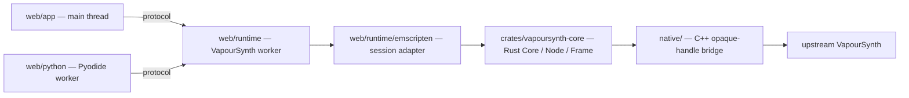

# VapourSynth WebAssembly

This project compiles the real upstream VapourSynth core to WebAssembly with Emscripten and runs it inside a dedicated browser worker, wrapped in a safe `no_std` Rust ownership layer (`Core` / `Node` / `Frame` handle tokens) behind a narrow C++ opaque-handle bridge. Python scripts are authored in a separate Pyodide worker that drives the VapourSynth worker over an asynchronous protocol, so no raw upstream pointers ever cross a Rust, worker, or JavaScript boundary.

## Status

- The `browser-integration` CI job builds the pinned upstream core with the Rust layer and Emscripten module, then runs the native, Rust, protocol, and integration suites.
- The canvas app renders a real `BlankClip → Invert` filter result end to end; `native/tests/render_invert.cpp` verifies every output pixel.
- Python scripting runs in a Pyodide worker and drives the VapourSynth worker asynchronously.
- Unsupported APIs fail with explicit errors rather than silently emulating desktop behaviour.

## Demo

```bash
git submodule update --init --recursive
uv sync --locked
./tools/build-browser.sh
npm run serve
```

Open `http://localhost:4173/web/app/index.html` (HTTP is required for ES modules and nested workers). The build applies the pinned upstream patch, compiles the Emscripten module, and runs the render-invert tests; generated artifacts land in `build/emscripten/`, `build/web/`, and `build/test/`.

## Architecture



Rust owns only thread-affine handle tokens; the C++ bridge retains the `VSAPI` table and every upstream pointer. The runtime is split across `web/app`, `web/runtime`, `web/protocol`, `web/python`, and `web/tests`. See [docs/architecture.md](docs/architecture.md) for the full design.

## Supported API

| Supported | Not yet |
| --- | --- |
| `vs.RGB24` | Other pixel formats |
| `vs.core.std.BlankClip` | Other namespaces and functions |
| `vs.core.std.Invert` | `std.Resize` (zimg) |
| `VideoNode` | Plugin discovery and native plugins |
| `vs.set_output()` | Video decoding/encoding, threaded scheduling |

Python calls are asynchronous because every graph request crosses from the Pyodide worker to the VapourSynth worker. Anything outside the supported subset raises an explicit unsupported error.

## Development

Prerequisites: Git, Node, UV, Rust 1.85.0 with the `wasm32-unknown-emscripten` target, and the Emscripten SDK on `PATH`. UV manages Python and Meson from `pyproject.toml` and `uv.lock`; Cargo and npm own their own dependency graphs (`Cargo.lock`, `package-lock.json`).

```bash
uv sync --locked
cargo test --workspace --locked
npm ci
npm test
uv run --locked python -m unittest discover -s web/python -p 'test_*.py'
```

See [docs/building.md](docs/building.md) for the full build, [docs/support.md](docs/support.md) for the support matrix, [docs/roadmap.md](docs/roadmap.md) for planned work, [docs/upstream.md](docs/upstream.md) for upstream pinning and patches, and [CONTRIBUTING.md](CONTRIBUTING.md) for contribution guidelines.
