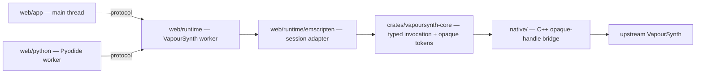

# VapourSynth WebAssembly

This project compiles the real upstream VapourSynth core to WebAssembly with Emscripten and runs it inside a dedicated browser worker, with a safe `no_std` Rust token-validation and invocation layer behind a narrow C++ opaque-handle bridge. Python scripts are authored in a separate Pyodide worker: the synchronous `vapoursynth` package records a graph plan, which the VapourSynth worker then executes with one generic typed invocation per operation, so no raw upstream pointers ever cross a Rust, worker, or JavaScript boundary.

## Status

- The `browser-integration` CI job builds the pinned upstream core with the Rust layer and Emscripten module, then runs the native, Rust, protocol, integration, and browser suites.
- A 17-filter common stdlib corpus executes end to end in the browser (Pyodide → RPC → Emscripten VapourSynth → canvas) with byte-exact pixels; every vector is also proven byte-exact by the native `render_plan` harness.
- Python authoring runs synchronously in a Pyodide worker and drains a graph plan that the VapourSynth worker executes generically.
- Unsupported APIs fail with explicit errors rather than silently emulating desktop behaviour.

## Demo

```bash
git submodule update --init --recursive
uv sync --locked
./tools/build-browser.sh
npm run serve
```

Open `http://localhost:4173/` — the root redirects to `/app/` (ES modules and nested module workers need an HTTP(S) origin, not `file://`). `npm run serve` serves the production distribution with `uv run --locked python -m http.server 4173 --directory build/web`. The build applies the pinned upstream patch, compiles the Emscripten module, and runs the native suites (including the byte-exact corpus harness); generated artifacts land in `build/emscripten/`, `build/web/`, and `build/test/`.

## Browser tests

```bash
npm run test:browser        # requires build/web (already built)
npm run test:browser:build  # ./tools/build-browser.sh, then the tests
```

`npm run test:browser` runs the Playwright spec in `web/tests/browser/` in headless Chromium against the production bundle in `build/web`, served under a subpath (`/web/app/`) so tests exercise the same base-path resolution as the GitHub Pages project site at `/vapoursynth-rust-webassembly/`. All demo URLs are relative, so the identical distribution works at any base path.

## Architecture



Rust handles only typed copies of thread-affine tokens; the C++ bridge owns the token table, the `VSAPI` table, every upstream pointer, and every paired release. The runtime is split across `web/app`, `web/runtime`, `web/protocol`, `web/python`, and `web/tests`. See [docs/architecture.md](docs/architecture.md) for the full design.

## Supported API

| Supported | Not yet |
| --- | --- |
| `vs.RGB24` | Other pixel formats |
| 17 common `vs.core.std.*` filters (see `docs/support.md`) | Other namespaces and functions |
| `VideoNode`, `vs.set_output()` | Plugin discovery and native plugins |
| Graph plans (64 ops / 16 outputs) | Video decoding/encoding, threaded scheduling |

`std.Resize` (zimg) and other formats are deliberately deferred. Python authoring is synchronous: each call records one typed operation in the plan, which the VapourSynth worker executes generically. Anything outside the supported subset raises an explicit unsupported error.

## Development

Prerequisites: Git, Node, UV, Rust 1.85.0 with the `wasm32-unknown-emscripten` target, and the Emscripten SDK on `PATH`. UV manages Python and Meson from `pyproject.toml` and `uv.lock`; Cargo and npm own their own dependency graphs (`Cargo.lock`, `package-lock.json`).

```bash
uv sync --locked
cargo test --workspace --locked
npm ci
npm test
uv run --locked python -m unittest discover -s web/python -p 'test_*.py'
```

See [docs/building.md](docs/building.md) for the full build, [docs/support.md](docs/support.md) for the support matrix, [docs/roadmap.md](docs/roadmap.md) for planned work, [docs/upstream.md](docs/upstream.md) for upstream pinning and patches, and [CONTRIBUTING.md](CONTRIBUTING.md) for contribution guidelines.
